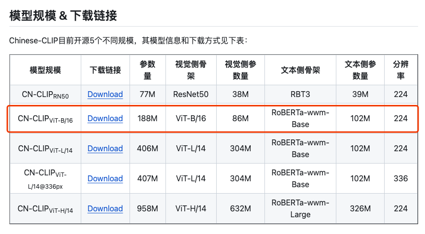

## 引言

时间：2023年11月14日

前段时间体验了photoprimse，使用上有诸多不便，例如无法直接删除照片，要归档后再删除，移动端没有app，不方便上传照片等等。

一番搜索下，找到了mtphotos，完美满足我的要求

[官方中文文档](https://mtmt.tech/docs/start/introduction)

## mtphotos优缺点

- 功能完善的移动端，可以后台自动备份
- 服务端使用docker搭建，很方便
- 操作逻辑符合直觉
- 可以方便的分享影集
- 人脸识别（识别度一般）
- 配置智能识别后，可以拥有文字搜图、场景识别
- 唯一的缺点可能就是服务端需要付费了，[25/年，99/终身](https://auth.mtmt.tech/buy)

## 搭建教程

本人使用mac mini m2搭建，其他系统请直接参考官方文档

### 安装docker

> 如果有现成的docker就直接进入容器创建环节

**方法一：命令方式安装docker**

用brew进行安装

```text
brew cask install docker
```

**方法二：Docker Desktop for Mac安装**

在Docker官网下载安装文件：https://docs.docker.com/desktop/install/mac-install/

打开Docker.dmg安装文件，拖动安装完成就可以了。

### 使用docker compose安装

```
version: "3"

services:
  mtphotos:
    image: mtphotos/mt-photos:arm-latest
    container_name: mtphotos
    restart: always
    ports:
      - 8063:8063
    volumes:
      - ./config:/config
      - ./upload:/upload
    environment:
      - TZ=Asia/Shanghai
      - LANG=C.UTF-8
```

> 下载没速度的话，可以让终端走代理进行加速：[终端代理教程](https://weilining.github.io/294.html)

这2个是必须要映射的目录

- config：配置文件，新建后留空就可以
- upload：可以根据使用人数再新建`user1` `user2`等子文件夹，用来存放照片

### 初始化安装

容器运行成功后，需要进行初始化安装；

使用浏览器打开地址：http://127.0.0.1:8063
选择系统的语言
创建管理员账户
设置图库
配置人脸识别、GPS信息识别等功能

## M系列芯片配置智能识别

仓库地址：[MT-Photos/mt-photos-ai: mt photos AI相关的独立服务 (github.com)](https://github.com/MT-Photos/mt-photos-ai)

### 安装miniconda，提供python虚拟环境

参考：[Miniconda — Anaconda documentation](https://docs.anaconda.com/free/miniconda/)

下载 `Miniconda3 macOS Apple M1 64-bit pkg`，双击安装

### 安装coremltool

参考：[Installing Core ML Tools — Guide to Core ML Tools (apple.github.io)](https://apple.github.io/coremltools/docs-guides/source/installing-coremltools.html)

**创建虚拟环境**

```
conda create --name coremltools-env
```

**激活虚拟环境**

```
conda activate coremltools-env
```

**安装python3.11**

```
conda install python=3.11
```

*后续安装的torch只支持到python3.11，如果安装以后版本会提示 `No module named 'imp'`*

**安装pip**

```
conda install pip
```

**pip安装coremltools**

```
pip install -U coremltools
```

**pip安装torch2.1.0和torchvision0.16**

`torch` `torchvision` `python`版本对照表：[pytorch/vision: Datasets, Transforms and Models specific to Computer Vision (github.com)](https://github.com/pytorch/vision#installation)

```
pip install torch==2.1.0
```

```
pip install torchvision==0.16
```

**pip安装cn_clip**

```
pip install cn_clip
```

**下载chinese_clip模型**

仓库地址：https://github.com/OFA-Sys/Chinese-CLIP

目前代码仅支持clip_cn_vit-b-16模型，其他模型需要自己改代码



### 使用 pytorch\_to\_coreml.py 将 PyTorch 模型转换为 CoreML 模型

**克隆代码**

```
git clone https://github.com/MT-Photos/mt-photos-ai.git
```

保留`coreml`文件夹，其他都可以删除

**将下载的模型移动进来后运行**

```
python3 pytorch_to_coreml.py --model-arch ViT-B-16 --save-coreml-path "./clip_cn_vit-b-16.mlmodel" --precision fp32 --convert-text --convert-vision --pytorch-ckpt-path "./clip_cn_vit-b-16.pt"
```

转换结束后你会得到两个模型文件：`clip_cn_vit-b-16.mlmodel.text.mlpackage` `clip_cn_vit-b-16.mlmodel.image.mlpackage`

**将模型文件移动到/utils/下**

**创建.env文件填入以下内容**

```
API_AUTH_KEY = "mt_photos_ai_extra_secret"
# path为完整路径
MODEL_PREFIX = "/path/clip_cn_vit-b-16.mlmodel"
```

**运行服务**

```
python3 server.py
```

**检测服务运行情况**

```
curl -X POST -F "file=@/path/to/your/image.jpg" -H "api-key: YOUR_API_KEY" http://127.0.0.1:8000/ocr
```

将`/path/to/your/image.jpg`替换为你实际想要上传的图片路径，以及`YOUR_API_KEY`替换为有效的API密钥。运行后有输出结果表示搭建成功呢

### mtphoto中填入接口信息

接口地址：`host.docker.internal:8000`

API_AUTH_KEY：`mt_photos_ai_extra_secret`

*如果你的mtphoto运行在docker容器内，需要使用`host.docker.internal:8000` ，它将解析到宿主机的8000端口；如果运行在本地，可以填入`localhost:8000`*

## 待完善的内容

### mac重启后需要在终端输入以下命令来手动重启智能识别

```
cd Pictures/mt_photos/mt-photos-ai
```

```
conda activate coremltools-env
```

```
python3 server.py
```


## 其他相关

[使用DDNS-GO通过ipv6进行外网访问](/?p=166)
[如何将照片从Googlephoto中迁移出来](https://kb.synology.cn/zh-cn/DSM/tutorial/How_do_I_migrate_photos_from_Google_Photos)