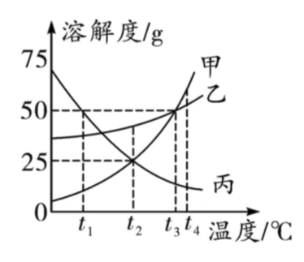

> 如图是甲、乙、丙三种固体物质的溶解度曲线，判断下列说法是否正确

### 甲的溶解度大于乙的溶解度 

错误，物质在不同温度下呈现的溶解度也不一样，在比较溶解度大小时，一定要确定温度。正确的应该是：在 $ t_4 \mathrm{°C}$ 时，$S_甲>S_乙$

### $t_1\mathrm{°C}$时75g丙的饱和溶液中溶质质量为25g

正确，根据图形， $ t_1\mathrm{°C}$ 时 $S_丙=50g$ ，即100g的水可以溶解50g的丙，推导出150g的丙饱和溶液中有50g的丙， $m_{溶液}：m_丙=3:1$ ，所以75g的丙饱和溶液中应有25g丙

### $t_2\mathrm{°C}$时甲的饱和溶液溶质质量分数为25%

错误，饱和溶液时溶质质量分数计算公式： $m_质\% = \frac{Sg}{Sg+100g} \times100\%$ ，可以计算得出 $t_2\mathrm{°C}$ 时甲的饱和溶液溶质质量分数$=\frac{25g}{25g+100g}\times100\%=20\%$

### $t_3\mathrm{°C}$时甲、乙溶液的溶质质量分数相等

错误，应该是 $t_3\mathrm{°C}$ 时甲、乙**饱和溶液**的溶质质量分数相等

### $t_1\mathrm{°C}-t_2\mathrm{°C}$之间乙、丙不能配制溶质质量分数相同的溶液

错误，根据饱和溶液时溶质质量分数计算公式： $m_质\% = \frac{Sg}{Sg+100g} \times100\%$ ，可以推断出如果图像上存在溶解度S相同的点，就 可以配制出相同的溶质质量分数。所以这句话是错误的。

### $t_1\mathrm{°C}$时，等质量的甲、乙、丙的饱和溶液中所含溶质的质量由大到小的关系为(    )，所含溶剂的质量由大到小的关系为(    )

同温度饱和状态下，溶解度大，那溶质质量分数也大。从图上可看出$t_1\mathrm{°C}$ 时 $S_丙>S_乙>S_甲$，得出 $m_丙\%>m_乙\%>m_甲\%$，在$m_{溶液}$ 相等时，溶质应该是$丙>乙>甲$ ，溶剂则是$甲>乙>丙$ 

### $t_4\mathrm{°C}$时，等质量的甲、乙、丙分别配制成饱和溶液，所需溶剂的质量由大到小的关系为(    )

从图上可看出$t_1\mathrm{°C}$ 时 $S_甲>S_乙>S_丙$，得出饱和状态下 $m_甲\%>m_乙\%>m_丙\%$，在$m_{溶质}$ 相等时，所需溶剂应该是$丙>乙>甲$ ，

### 若甲中混有乙，应采用（降温结晶）来提纯甲；若乙中混有甲，应采用（蒸发结晶）来提纯乙

解题诀窍：不看杂质，看想提纯的物质。本题中甲的溶解度受温度影响较大，提纯甲应该用降温结晶；乙的溶解度受温度影响较小，提纯乙应该用蒸发结晶。

### 将$t_3\mathrm{°C}$时等质量的甲、乙、丙的饱和溶液同时降温到$t_1\mathrm{°C}$，溶质质量分数：乙>丙

解题诀窍：

1. 降温时，无论是析出还是不析出，水量始终不变
2. 饱和状态下，溶解度的大小对应溶质质量分数的大小

$t_3$ 时，乙丙均饱和且溶液质量相等，由图可知 $S_乙>S_丙$，则 $m_乙>m_丙$ 且$水_丙>水_乙$；降温到 $t_1$ 时，乙有晶体析出，但从乙的溶解度曲线看，析出后剩余的 $m_乙$ 依旧大于 $m_丙$，所以  $m_乙\%>m_丙\%$ 