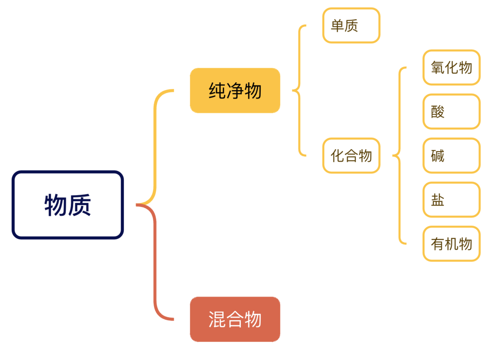

# 物质分类

1. **纯净物**
   - 定义：由同种物质组成的物质（如：氧气 $\ce{O₂}$ 、蒸馏水 $\ce{H₂O}$ ）
   - 特征：有固定组成、能用化学式表示
2. **混合物**
   - 定义：由两种或多种物质混合而成（如：空气、合金、溶液）
   - 特征：不能用化学式表示、各成分保持原有性质、可用物理方法分离
3. **单质**
   - 定义：由一种元素组成的纯净物（如：铁 $\ce{Fe}$ 、氧气 $\ce{O₂}$ ）
4. **化合物**
   - 定义：由两种或两种以上元素组成的纯净物
   - 重要分类：
     - **氧化物**：由两种元素组成、其中一种为氧元素（如： $\ce{H₂O、Fe₃O₄}$ ）
     - **酸**：电离时产生的阳离子全部是 $\ce{H⁺}$ （如： $\ce{HCl、H₂SO₄、HNO3、H2CO3 }$ ）
     - **碱**：电离时产生的阴离子全部是 $\ce{OH⁻}$ （如： $\ce{NaOH、Ca(OH)₂}$ ）
     - **盐**：含金属阳离子（或 $\ce{NH₄⁺}$ ）和酸根离子（如： $\ce{NaCl、CaCO₃}$  ）
5. **有机物**
   - 定义：含碳化合物（除 $\ce{CO、CO₂}$ 、碳酸盐等）
   - 举例：甲烷 $\ce{CH4}$ 、乙醇 $\ce{C2H5OH}$ 、葡萄糖 $\ce{C₆H₁₂O₆}$ 、蛋白质、糖类、油脂、维生素

> [!note]
>
> **名词解释**
>
> 电离：物质溶解时离解成能自由移动的离子的过程。例如 $\ce{NaCl}$ 溶解在水中，电离为 $\ce{Na+}$ 离子和 $\ce{Cl-}$ 离子
>
> 酸根离子：酸电离产生的阴离子（如 $\ce{Cl-}$ 、 $\ce{SO_4^2-}$ 、 $\ce{NO3-}$ 、 $\ce{CO3^2-}$ ）

