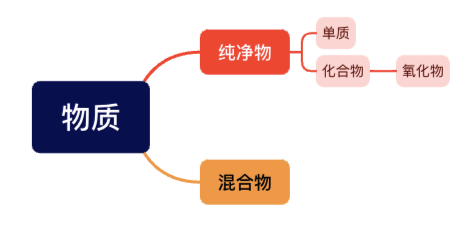

> [!note]现有下列物质：①矿泉水；②液氧；③洁净的空气；④加热高锰酸钾至完全分解后的残留物；⑤干冰；⑥氖气；⑦白磷：⑧四氧化三铁； ⑨二氧化硫；⑩加热氯酸钾和二氧化锰的混合物至完全分解后的残留物。其中
> 属于混合物的有：
> 属于纯净物的有：
> 属于单质的有：
> 属于化合物的有：
> 属于氧化物的有：

> [!note]参考答案
>
> 属于混合物的有：①③④⑩
> 属于纯净物的有：②⑤⑥⑦⑧⑨
> 属于单质的有：②⑥⑦
> 属于化合物的有：⑤⑧⑨
> 属于氧化物的有：⑤⑧⑨

分析：做这种题目，首先要理清各概念之间的包含关系，先来看物质分类的图

由图上可以看出，一个物质如果是氧化物，那它同时也是化合物和纯净物。

理解上图中的包含关系以后，我们再看各概念的定义和举例，如下

1. **混合物（由两种或两种以上物质组成）**

	•	空气：由氮气、氧气、二氧化碳等多种气体组成。
	•	海水：由水、盐、溶解的矿物质等组成。
	•	牛奶：由水、蛋白质、脂肪、乳糖等成分混合而成。
	•	合金：如黄铜，由铜和锌的混合物。
	
2. **纯净物（由一种物质组成）**

	•	纯水（$\ce{H_2O}$）：一种化合物。
	•	氮气（$\ce{N_2}$）：一种单质。
	•	二氧化碳（$\ce{CO_2}$）：一种化合物。
	•	氯化钠（俗称食盐，$\ce{NaCl}$）：一种化合物。
	•	氧气（$\ce{O_2}$）：一种单质。

3. **单质（由一种元素组成的纯净物）**

	•	氧气（$\ce{O_2}$）：由氧元素组成。
	•	氢气（$\ce{H_2}$）：由氢元素组成。
	•	铁（$\ce{Fe}$）：由铁元素组成。
	•	金（$\ce{Au}$）：由金元素组成。
	•	氮气（$\ce{N_2}$）：由氮元素组成。

4. **化合物（由两种或两种以上元素组成的纯净物）**

	•	水（$\ce{H_2O}$）：由氢和氧两种元素组成的化合物。
	•	二氧化碳（$\ce{CO_2}$）：由碳和氧组成的化合物。
	•	氯化钠（食盐，$\ce{NaCl}$）：由钠和氯组成的化合物。
	•	碳酸钙（$\ce{CaCO_3}$）：由钙、碳、氧组成的化合物。
	•	甲烷（$\ce{CH_4}$）：由碳和氢组成的化合物。

5. **氧化物（由两种元素组成、其中一种为氧元素的纯净物）**

	•	二氧化碳（$\ce{CO_2}$）：碳的氧化物。
	•	水（$\ce{H_2O}$）：氢的氧化物。
	•	四氧化三铁（$\ce{Fe_3O_4}$）：铁的氧化物。
	•	氧化钙（生石灰，$\ce{CaO}$）：钙的氧化物。
	•	二氧化硫（$\ce{SO_2}$）：硫的氧化物。