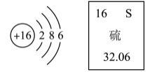
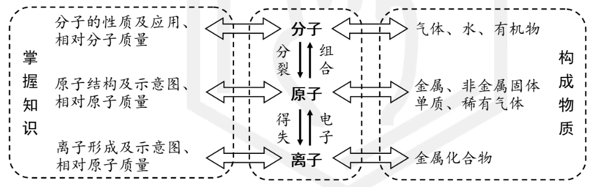
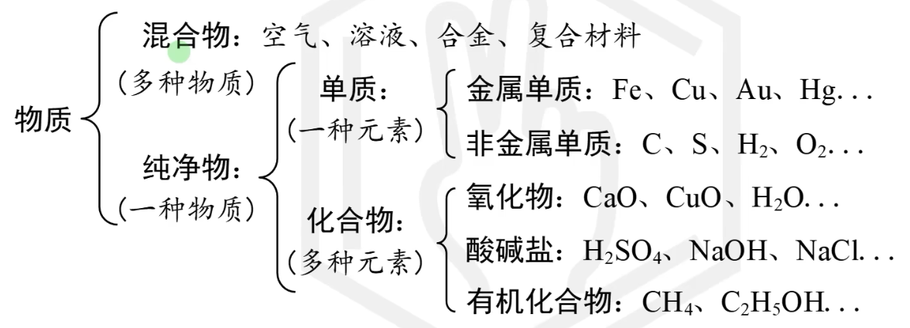

## 元素周期表

原子序数（核电荷数、质子数、核外电子数)、元素符号、中文名称、相对原子质量

相对原子质量 = 质子数 + 中子数

## 微观与宏观

**微观（微粒视角）**：分子、原子、离子、质子、电子、中子

微粒之间的关系用**构成**来进行描述，例如：一个水分子是由2个氢原子和1个氧原子构成的；一个碳原子核是由6个质子和6个中子构成的。 

**宏观（人类视角）**：物质、元素

宏观物质用**组成**来进行描述，例如：水是由氢元素和氧元素组成的。

### 习题

1. 水由__________组成
1. 水由__________构成
1. 水分子由__________构成	
1. 1个水分子由__________构成

### 总结

- 物质由元素组成
- 物质由分子（原子/离子）构成
- 分子由原子构成
- 个数对个数，微观才讲个数，宏观不讲个数

## 物质分类

经典错误描述：由一种元素组成的物质是纯净物。反例：由 $O_2$ 和 $O_3$ 组成的物质是混合物。

补充

- 氧化物：两种元素组成，其中一种元素是O
- 酸：阳离子仅有 $H^+$ 离子的化合物
- 碱：阴离子仅有 $OH^-$ 离子的化合物

## 化学反应类型

### 四大基本反应类型

- 化合反应：多合一
- 分解反应：一变多
- 置换反应：单质置换（一定有化合价变化）
- 复分解反应：2个化合物互相交换成分，生成2个化合物。（没有化合价变化）

### 其他反应

- 氧化反应：物质与氧发生的反应（得到氧的反应）
- 还原反应：物质失去氧的反应
- 中和反应：酸 + 碱 生成 盐 + 水，属于复分解反应的一种，本质是酸中的$H^+$与碱中的$OH^-$结合生成水分子