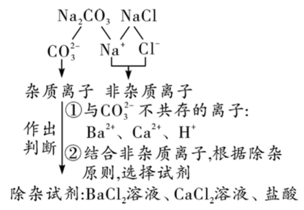

# 除杂专题

## 除杂原则：不减不增易分离

1. 不减：所选试剂**不能与原物质反应**

2. 不增：在除去杂质的同时，**不引入新杂质**
   
   > **状态相同**的才叫新杂质

3. 易分离：除杂后生成的**产物的状态**要与**被提纯物质的状态不同**，方便除去

## 除杂方法（括号内为杂质）

### 气体除杂

#### 吸收法

将杂质气体通过物质吸收、反应除去。

1. $\ce{O2(水蒸气)}$：通过浓硫酸
   
   > 浓硫酸具有吸水性，常用来干燥气体

2. $\ce{CO(CO2)}$：通过浓$\ce{NaOH}$溶液，再通过浓硫酸 
   
   > $\ce{CO}$与$\ce{CO2}$的混合气通过浓$\ce{NaOH}$溶液后，$\ce{CO2}$被反应去除，出来的是未参与反应的$\ce{CO}$与带出的水蒸气（新杂质）
   > 
   > $\ce{2NaOH + CO2\xlongequal{}Na2CO3 +H2O}$
   > 
   > 再通过浓硫酸去除水蒸气，可得到纯净的$\ce{CO}$气体

3. $\ce{H₂(HCl)}$：通过浓$\ce{NaOH}$溶液，再通过浓硫酸
   
   > 同理

4. $\ce{CO₂(O2)}$：通过灼热的铜网
   
   > $\ce{CO2}$与$\ce{O2}$的混合气通过灼热铜网后，$\ce{O2}$被反应去除，出来的是未参与反应的$\ce{CO2}$
   > 
   > $\ce{2Cu + O2\xlongequal{\triangle} 2CuO}$

5. $\ce{N2(O2)}$：通过灼热的铜网
   
   > 同理

6. $\ce{CO₂(CO)}$：通过灼热的氧化铜
   
   > 常见错误操作：通入适量氧气，点燃
   > 
   > 错误原因：$\ce{CO2}$的量远超$\ce{CO}$，在存在大量不可燃不支持燃烧的$\ce{CO2}$环境中，无法燃烧

#### 转化法

将杂质气体转化为要保留的气体

1. $\ce{CO2(HCl)}$：通过饱和的$\ce{Na2CO3}$溶液或$\ce{NaHCO3}$溶液，再通过浓硫酸
   
   > $\ce{CO2}$与$\ce{HCl}$的混合气通过浓$\ce{Na2CO3}$溶液后，$\ce{HCl}$被反应去除，出来的是未参与反应的$\ce{CO2}$与生成的$\ce{CO2}$和水蒸气（新杂质）
   > 
   > $\ce{Na2CO3 + 2HCl\xlongequal{}2NaCl + H2O + CO2 ^}$ 或 $\ce{NaHCO3 + HCl\xlongequal{}NaCl + H2O + CO2 ^}$
   > 
   > 再通过浓硫酸去除水蒸气，可得到纯净的$\ce{CO2}$气体

2. $\ce{CO2(CO)}$：通过灼热的氧化铜
   
   > $\ce{CO2}$与$\ce{CO}$的混合气通过灼热的氧化铜后，$\ce{CO}$被反应去除，出来的是未参与反应的$\ce{CO2}$与生成的$\ce{CO2}$
   > 
   > $\ce{CuO + CO \xlongequal{\triangle} Cu + CO2}$ 

#### 错误的气体除杂

| 被提纯物质      | 杂质        | 错误的除杂方法 | 原因                          |
|:----------:|:---------:| ------- | --------------------------- |
| $\ce{N2}$  | $\ce{CO}$ | 通入足量的水中 | $\ce{N2}$与$\ce{CO}$都不溶于水    |
| $\ce{CO2}$ | $\ce{O2}$ | 通过灼热的炭  | $\ce{O2}$是杂质，量很少，没有达到燃烧需要的量 |
| $\ce{CO2}$ | $\ce{CO}$ | 点燃      | 没有氧气，无法点燃                   |

### 固体除杂

①当被提纯物质与杂质中只有一种可溶于水或杂质能与水反应时，采用水溶解过滤的方法除杂。

②被提纯物质与杂质均溶于水，可加水溶解，再采用蒸发结晶或降温结晶的方法除杂。

③当两种物质都难溶于水时，可通过两者的化学性质除杂

#### 物理方法

1. $\ce{NaCl}$(泥沙)：加水溶解，过滤，蒸发结晶 

2. $\ce{KCl(MnO2)}$：加水溶解，过滤，洗涤干燥

3. $\ce{KNO3(NaCl)}$：加水溶解，降温结晶 
   
   > KNO3溶解度是陡升型，NaCl溶解度受温度影响不大

#### 化学方法

1. $\ce{Cu(Zn)}$：加足量的稀盐酸，充分反应后过滤、洗涤、干燥
   
   > $\ce{Zn}$与稀盐酸反应，$\ce{2HCl + Zn\xlongequal{} ZnCl2 + H2 ^}$，$\ce{Cu}$不反应

2. $\ce{Cu(CuO)}$：加足量的稀盐酸，充分反应后过滤、洗涤、干燥
   
   > $\ce{CuO}$与稀盐酸反应，$\ce{2HCl + CuO\xlongequal{} CuCl2 + H2 ^}$，$\ce{Cu}$不反应

3. $\ce{Fe2O3(碳粉)}$：在氧气流中加热
   
   > $\ce{C + O2\xlongequal{\triangle} CO2}$ 

4. CaO(CaCO3)：高温煅烧
   
   > $\ce{CaCO3\xlongequal{高温} CaO + CO2 ^}$ 

5. KCI(KCIO3)：加热
   
   > $\ce{2KClO3\xlongequal[\triangle]{MnO2} 2KCl + 3O2 ^}$ 

6. Na2CO3(NaHCO3)：加热
   
   > $\ce{2NaHCO3\xlongequal{\triangle}Na2CO3 + H2O + CO2 ^}$

#### 错误的固体除杂

| 被提纯物质       | 杂质         | 错误的除杂方法    | 原因                |
|:-----------:|:----------:| ---------- | ----------------- |
| $\ce{MnO2}$ | $\ce{KCl}$ | 溶解、过滤、蒸发结晶 | 蒸发结晶改为**洗涤干燥**    |
| 银粉          | 锌粉         | 加入过量硫酸亚铁溶液 | 锌粉会置换出铁单质，引入了新的杂质 |
| 碳酸钙         | 氯化钠        | 足量的水       | 应加足量的水溶解，过滤，洗涤干燥  |

### 液体除杂

①对比，确定杂质离子，判断杂质离子是阳离子还是阴离子

②思考与杂质离子不共存的离子有哪些

> 不共存：指能生成气体、沉淀、水

③将②中与杂质离子不共存的离子，与非杂质离子结合，确定除杂试剂。

#### 例题

除去氯化钠溶液中的碳酸钠

#### 练习

请完成下列表格

| 物质(杂质)                | 杂质离子 | 除杂试剂(写化学式) |
|:---------------------:|:----:|:----------:|
| $\ce{NaOH溶液(Na2CO3)}$ |      |            |
| $\ce{NaCl溶液(Na2SO4)}$ |      |            |
| $\ce{NaCl溶液(NaOH)}$   |      |            |
| $\ce{KCI溶液(CaCl2)}$   |      |            |
| $\ce{CaCl2溶液(HCl)}$   |      |            |

> 加入的除杂试剂都需适量

#### 特殊情况

1. 组合出的除杂试剂是不溶物，需要采用其他的除杂方法
   
   > $\ce{FeSO4溶液(CuSO4)}$ ，按以上方法组合出的是$\ce{Fe(OH)2}$，是一个不溶物，所以不可以采用
   > 
   > 正确的做法是加入足量铁粉，充分反应后过滤

2. 当被提纯物质与杂质所含阴、阳离子都不相同时，选取与杂质中阴、阳离子都不共存的阳、阴离子组合成除杂试剂
   
   > $\ce{NaNO3溶液(CuSO4)}$ ，选择加入适量$\ce{Ba(OH)2}$溶液来除杂