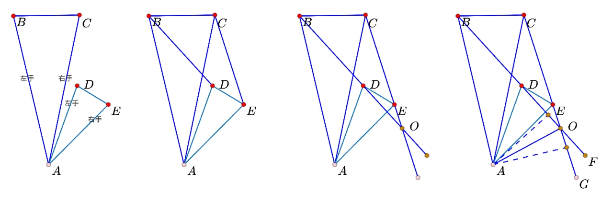
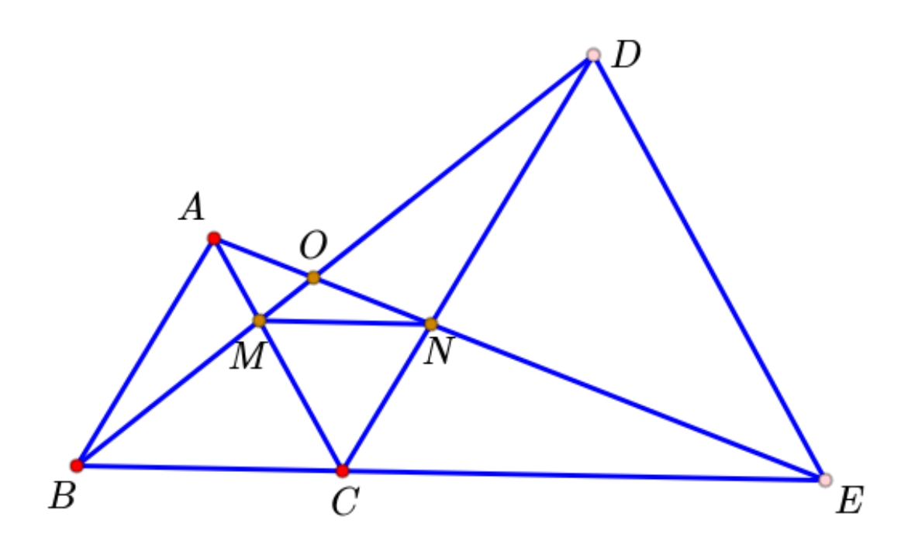
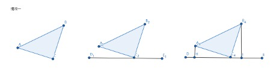
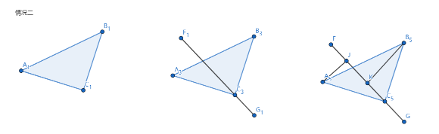
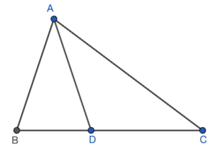
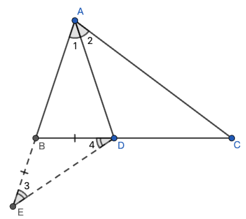
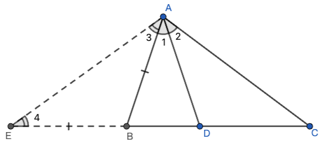
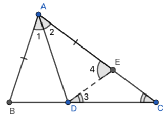

# 三角形——全等模型

## 答题习惯

一定要标注，用不同颜色的笔分组标记等角等边

## 主要模型类型

- 手拉手模型

- 三垂直模型（一线三等角）
- 中线倍长模型
- 全等辅助线之截长补短
- 半角模型（用截长补短做辅助线）
- 等补四边形模型

## 手拉手模型

### 模型讲解

  

1. **两个等腰三角形，共顶点，顶角相等。**

   *如图一，$AB=AC,AD=AE,\angle BAC=\angle DAE$*

2. **识别左右手连线，顶点与左右手连线构成的2个三角形全等。**

   *如图二，顶点A与左手连线BD构成$\Delta ABD$，顶点A与右手连线构成$\Delta ACE$，$\Delta ABD\cong\Delta ACE(SAS)$*

3. **左右手连线相交产生2组对顶角（如果未相交，可以做延长让它们相交），其中有一组对顶角与等腰三角形顶角相等。**

   *如图三，$\angle DOE=\angle BAC$*

   *证明思路：根据$\Delta ABD\cong\Delta ACE$，$\angle ABD=\angle ACE$，8字型 $COBA$ 得出$\angle DOE=\angle BAC$*

   *部分顶角为直角的可以直接计算角度来证明*

4. **识别左右手连线的交点，交点与顶点的连线是角平分线**

   *如图四，$OA$平分$\angle DOG$，证明思路：过点$A$分别向$DO,OG作垂线段$。两个垂线段分别是$\Delta ABD,\Delta ACE$的高，因为两三角形全等，所以面积与底都相等，所以高也相等，得出两垂线段相等，得出OA平分$\angle DOG$*

### 典型例题：两等边三角形手拉手

如图，$\Delta ABC$与$\Delta CDE$ 为等边三角形，B、C、E三点共线

**八大结论（证明并记住所有结论）**

1. $\Delta ACE\cong\Delta BCD,AE=BD$
1. $\angle AOB=\angle DOE=60^{\circ}$
1. $OC$ 平分$\angle BOE$
1. $\Delta ACN\cong\Delta BCM$
1. $\Delta CEN\cong\Delta CDM$
1. $\Delta CMN$是等边三角形
1. $MN// BE$
1. $OB=OA+OC,OE=OD+OC$

### 总结

- 模型识别技巧：首先找到公共顶点，简称头。然后依次找大图的左手，小图的左手，确认2个左手的连线。再找大图的右手，小图的右手，确认右手的连线。两个连线分别与顶点构成一组全等三角形（简记头左左$\cong$ 头右右）（SAS）

- 左手连线与右手连线形成的夹角，叫做拉手夹角，拉手夹角＝顶角（“8”字形证明）

- 手拉手模型衍生出来的性质（边相等，角相等），可以与其他模型结合使用

##  三垂直模型（一线三等角）

模型构造：

1. 一个等腰直角三角形
2. 一条穿过等腰直角三角形顶点的直线（2种画法）
3. 过两个底角顶点分别向直线做垂线段

​                               

 

 

模型结论：

1. 全等：垂线段与顶点构成的2个三角形全等（AAS）

## 倍长中线

## 全等辅助线之截长补短

#### 例题一

如图，在$\Delta ABC$中，$\angle B=2\angle C$，$\angle BAC$ 的平分线 $AD$交 $BC$于点 $D$。求证：$AB+BD=AC$

*解析：对于这种求线段数量关系的题目，截长补短是常见的辅助线做法，在本题中，我们是求证AB、BD、AC三条线段之间的关系，首先确定AB、BD为短边，AC为长边。我们可以采取延长短边 或 截取长边两种辅助线做法。*

**补短法一，延长AB至点E，使BE=BD，连DE**

先证明 $\angle 3=\angle C$，得到$\Delta ADE\cong\Delta ADC$（AAS），得出$AB+BE=AE$，所以$AB+BD=AC$

**补短法二，延长DB至点E，使BE=AE，连DE**

先证明 $\angle 3=\angle 4=\angle C$，得出$AE=AC$，再通过$\angle C+\angle 2=\angle ADE$，$\angle 3+\angle 1=\angle DAE$，得出$\angle ADE=\angle DAE$，所以$AE=DE=AC$，又因为$BE+BD=DE$，所以$AB+BD=AC$

**截长法一，在 $AC$上截取一点$E$，使$AE=AB$，连$DE$**

先证明$\Delta ABD\cong\Delta AED$（SAS），得出$BD=DE$，再证明$\angle 3=\angle C$得出$CE=DE$，又因为$AE+CE=AC$，所以$AB+BD=AC$

> [!IMPORTANT] 总结
>
> 从以上步骤可以看出，我们采取不同的截长补短策略，会直接影响到后续的解题思路和解题难度，在实际做题时，应通过分析寻找经可能简单的截长补短做法。
>
> 同时，也并不是所有的截长补短辅助线都能证明到题目需要的结论，部分题型是只有唯一的解法的。

## 半角模型

## 角平分线性质

- 构造全等，转移线段

