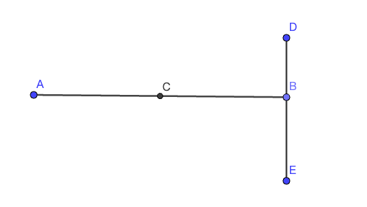
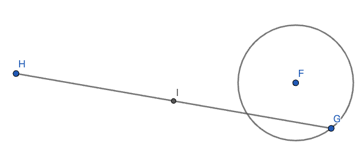

# 瓜豆原理——种瓜得瓜，种豆得豆

瓜豆原理是用来确定`从动点`运动轨迹的工具（根据运行轨迹的形态不同，可以分为直线型与曲线型两种），在画出轨迹后，可以延伸出两种题型
- 求轨迹长度
- 定点到轨迹的最值

瓜豆原理虽然属于压轴题，但是大部分都是以`填空选择`或`直接写结论`的题型进行考试，因为瓜豆原理的题目没有办法进行很好的说理，一般不会考需要写证明过程的大题

学习难度：困难
学习时间：建议初三上学期

## 分类

### 直线型

### 圆形

## 概念
1. 定点 主动点 从动点
1. 主轴 从轴
1. 主动点运动轨迹（主轨） 从动点运动轨迹（从轨）

## 前提
满足以下2个前提条件，就可以套用瓜豆原理的结论
1. 主轴与从轴的比值不变
1. 主轴与从轴的夹角不变

## 结论
### 通用结论
**主轨形状与从轨形状保持一致**

### 直线型结论
*主轨与从轨都是直线*
1. 主轨长度 / 从轨长度 = 主轴 / 从轴
1. 主轨与从轨的夹角 = 主轴与从轴的夹角

### 圆形结论
*主轨与从轨都是圆*
1. 主轨半径 / 从轨半径 = 主轴 / 从轴
1. 定点到主轨圆心的距离 / 定点到从轨圆心的距离 = 主轴 / 从轴
1. `定点到主轨圆心的连线`与`定点到从轨圆心的连线`的夹角 = 主轴与从轴的夹角

## 从动点轨迹画法
### 直线型 
1. 标信息：定点，主动点，从动点
1. 根据题目描述依次画`起始点`，`终点`
1. 连`起始点`，`终点`

### 圆形
1. 标信息：定点，主动点，从动点
1. 根据圆形结论找`从轨圆心`，计算`从轨半径`
1. 画圆
