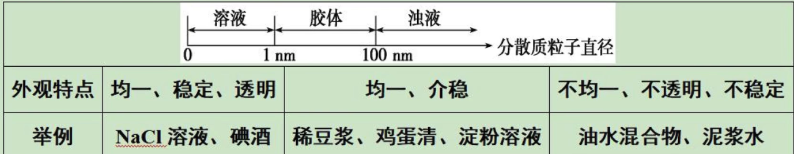

## 分散系：分散质+分散剂

鉴别胶体与溶液：丁达尔效应

当一束光通过胶体时，形成一条光亮的“通路”，这是胶体粒子对光线散射造成的

能透过滤纸：溶液、胶体

能透过半透膜：溶液

常见实例

- 溶液：食盐水、$\ce{CuSO4}$ 溶液
- 胶体：$\ce{Fe(OH)3}$ 胶体、豆浆、鸡蛋清
- 浊液：石灰乳、泥沙水

## 离子方程式

用实际参加反应的离子符号来表示反应的式子

### 拆卸规律

- 单质、氧化物、气体、难溶物、弱电解质（弱酸、弱碱、水）一律写化学式
- 酸式盐
  - 强酸的酸式盐：全拆，如$\ce{NaHSO4}$写成$\ce{Na+、H+、SO4^2-}$ 
  - 弱酸的酸式盐：半拆，如$\ce{NaHCO3}$写成$\ce{Na+、HCO3-}$
- 三大浓酸
  - 浓盐酸、浓硝酸：写离子形式
  - 浓硫酸：写化学式$\ce{H2SO4}$ ，因为浓硫酸浓度高到98%，几乎没有水可供电离

### 书写技巧

- 少量为1，先中和后沉淀
- 检查**原子个数**和**电荷总数**是否相等

### 离子共存

**判断一：溶液颜色**

当溶液无色时，有色离子不会大量共存（注意区分无色和透明）

有色离子：$\ce{Cu^2+}$ 蓝色、$\ce{Fe^2+}$ 浅绿、$\ce{Fe^3+}$ (棕)黄色、$\ce{MnO4-}$ 紫色、$\ce{CrO4^2-}$ 黄色、$\ce{Cr2O7^2-}$ 橙色

**判断二：溶液酸碱性条件**

- 溶液呈强酸性时，与$\ce{H+}$ 反应的离子无法大量存在：
  - 氢氧根离子：$\ce{OH-}$ 
  - 弱酸根离子：如$\ce{CO3^2-}$、$\ce{SO4^2-}$、$\ce{S^2-}$、$\ce{CH3COO-}$、$\ce{ClO}$-、$\ce{AlO2-}$、$\ce{F-}$ 等
    - 反之，$\ce{H+}$ 可以和$\ce{ClO4-}$、$\ce{I-}$、$\ce{Br-}$、$\ce{Cl-}$、$\ce{NO^3-}$、$\ce{SO4^2-}$ 等强酸根大量共存
- 溶液呈强碱性时，与$\ce{OH-}$ 反应的离子无法大量存在：
  - 氢离子：$\ce{H+}$ 
  - 铵根离子：$\ce{NH4+}$ 
  - 与氢氧根形成沉淀的金属阳离子：除$\ce{K+}$、$\ce{Na+}$、$\ce{Ba^2+}$ 
- 无论是强酸性还是强碱性，皆无法大量共存的离子：
  - 弱酸的酸式根离子：如$\ce{HCO3^-}$、$\ce{HSO3-}$、$\ce{HS-}$、$\ce{H2PO4-}$、$\ce{HPO4^2-}$、$\ce{HC2O4-}$ 
    - $\ce{HCO3- + H+ \xlongequal{} CO2 ^ +H2O}$ 
    - $\ce{HCO3- + OH- \xlongequal{} CO3^2- +H2O}$ 

**判断三：常见的难溶物、微溶物**

难溶物

- $\ce{SO4^2-}$与$\ce{Ba^2+}$、$\ce{Pb^2+}$ 

- $\ce{Ag+}$与$\ce{Cl-}$、$\ce{Br-}$、$\ce{I-}$  （补充：$\ce{AgCl}$白色、$\ce{AgBr}$淡黄色、$\ce{AgI}$黄色 ）

- $\ce{CO3^2-}$、$\ce{SO3^2-}$与$\ce{Ca^2+}$、$\ce{Ba^2+}$ 

四大微溶物

- $\ce{CaSO4}$、$\ce{Ca(OH)2}$、$\ce{MgCO3}$、$\ce{Ag2SO4}$ 

**判断四：离子间发生氧化还原反应不共存**

$\ce{Fe^3+}$、$\ce{NO3-(H+)}$ 等具有氧化性的离子

## 判断氧化还原反应

1. 在化学方程式上标出元素的化合价
2. 化合价升高，代表失去电子，叫还原剂，具有还原性，发生氧化反应，得到氧化产物
3. 化合价降低，代表得到电子，叫氧化剂，具有氧化性，发生还原反应，得到还原产物

口诀：杨家将——氧化剂（杨）的化合价（家）是降低（降）的

## 钠及其化合物

### 焰色反应

实验用品：铂丝或铁丝、稀盐酸、酒精灯

钠元素：黄色

钾元素：紫色

### 钠与氧气

常温：$\ce{4Na + O2 \xlongequal{} 2Na2O}$ 

加热：$\ce{2Na + O2 \xlongequal{\triangle} Na2O2}$ 

### 钠与水

$\ce{2Na + 2H2O \xlongequal{} 2Na+ + 2OH- + H2 ^}$ 

现象：浮、熔、游、响、红

### $\ce{Na2O}$ 与$\ce{Na2O2}$ 的比较

- 与$\ce{H2O}$ 反应
  - $\ce{Na2O + H2O \xlongequal{} 2NaOH}$
  - $\ce{2Na2O2 + 2H2O \xlongequal{} 4NaOH + O2 ^}$
- 与$\ce{CO2}$ 反应
  - $\ce{Na2O + CO2 \xlongequal{} Na2CO3}$
  - $\ce{2Na2O2 + 2CO2 \xlongequal{} 2Na2CO3 + O2}$

### $\ce{Na2CO3}$ 与$\ce{NaHCO3}$ 的比较

热稳定性：$\ce{NaHCO3 \xlongequal{\triangle} Na2CO3 + CO2 ^ +H2O}$

一般用来鉴别两种物质或测定一种物质的含量

## 氧化物

两性氧化物：$\ce{Al2O3}$ 

$\ce{Al2O3 + 6HCl \xlongequal{} 2AlCl3 + 3H2O}$ 

$\ce{Al2O3 + NaOH \xlongequal{} 2NaAlO2 + H2O}$ 