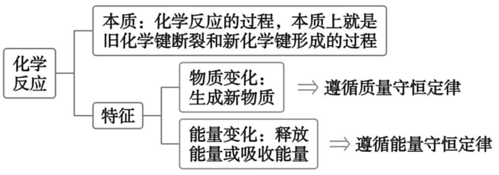
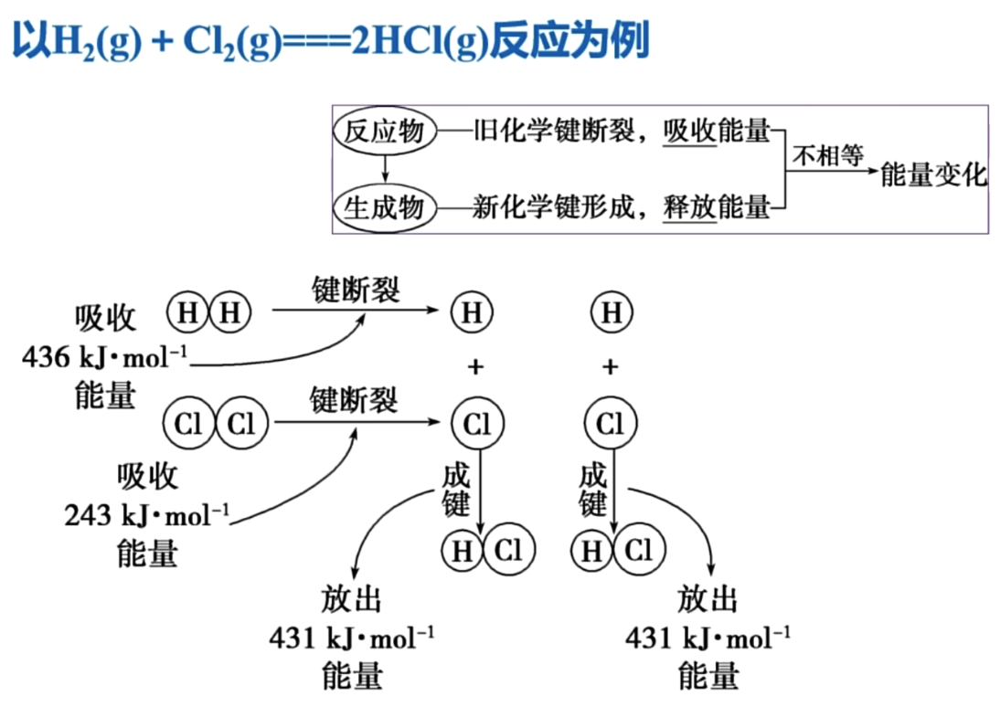

# 必修二

## 反应与能量

### 吸热反应与放热反应
放热反应：释放热量的化学反应

- 金属与水或酸的反应
- 中和反应
- 燃烧反应
- 大多数化合反应

吸热反应：吸收热量的化学反应

- 氢氧化钡晶体与氯化铵的反应
- 盐酸与碳酸氢钠的反应
- C + CO2高温2CO
- C + H2O(g)高温CO + H2（水煤气）
- 大多数分解反应

### 化学反应的本质与特征

