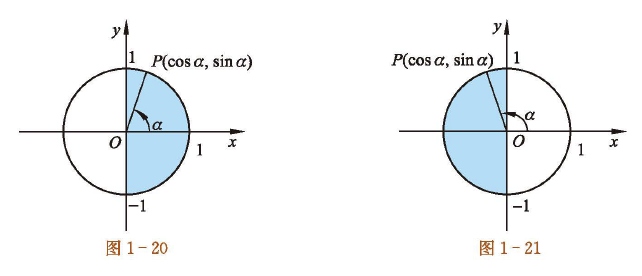
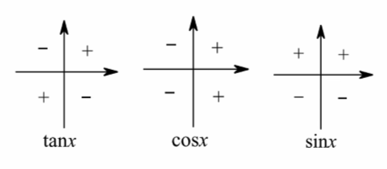
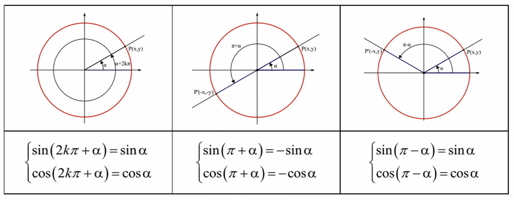
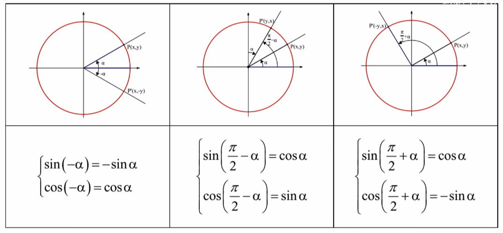
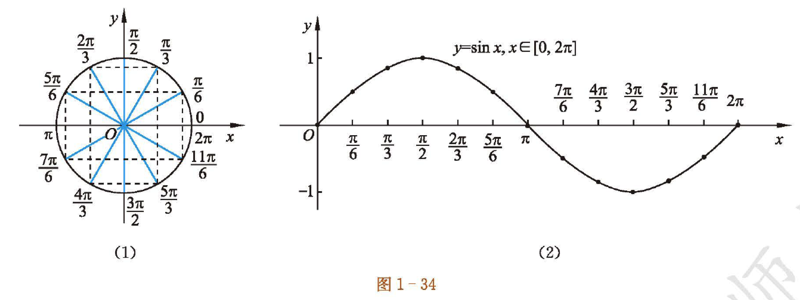
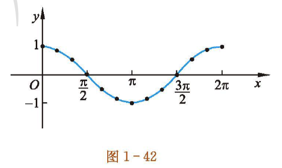

# 第一章 三角函数

## 任意角和弧度制

一、任意角的概念

角可以看成平面内一条射线绕着端点从一个位置旋转到另一位置所成的图形。

二、角的分类

1. 正角：按逆时针方向旋转形成的角叫做正角
2. 负角：按顺时针方向旋转形成的角叫做负角
3. 零角：一条射线没有作任何旋转形成的角叫做零角

三、象限角

定义：为了研究角的方便，常把角放在平面直角坐标系内，具体做法为：角的顶点与坐标原点重合，角的始边与 $x$ 轴的非负半轴重合，则角的终边（除端点外）在第几象限，就称这个角为第几象限角。

象限角的表达方式不唯一，以下是常用表达方式

第一象限角：$\{x\mid k\cdot360^{\circ}<x<90^{\circ}+k\cdot360^{\circ},k\in\mathbf{Z}\}$

第二象限角：$\{x\mid 90^{\circ}+k\cdot360^{\circ}<x<180^{\circ}+k\cdot360^{\circ},k\in\mathbf{Z}\}$

第三象限角：$\{x\mid 180^{\circ}+k\cdot360^{\circ}<x<270^{\circ}+k\cdot360^{\circ},k\in\mathbf{Z}\}$

第四象限角：$\{x\mid 270^{\circ}+k\cdot360^{\circ}<x<360^{\circ}+k\cdot360^{\circ},k\in\mathbf{Z}\}$

四、轴线角的表示

轴线角表达方法方式也不唯一，以下是常用表达方式

 $x$ 轴非负半轴上的角：$\{x\mid k\cdot360^{\circ},k\in\mathbf{Z}\}$

 $x$ 轴非正半轴上的角：$\{x\mid 180^{\circ}+k\cdot360^{\circ},k\in\mathbf{Z}\}$

 $x$ 轴上的角：$\{x\mid k\cdot180^{\circ},k\in\mathbf{Z}\}$

 $y$ 轴非负半轴上的角：$\{x\mid 90^{\circ}+k\cdot360^{\circ},k\in\mathbf{Z}\}$

 $y$ 轴非正半轴上的角：$\{x\mid -90^{\circ}+k\cdot360^{\circ},k\in\mathbf{Z}\}$

 $y$ 轴上的角：$\{x\mid 90^{\circ}+k\cdot180^{\circ},k\in\mathbf{Z}\}$

五、终边相同的角

一般地，所有与角 $a$ 的终边相同的角，连同角 $a$ 在内，可表示成集合$S=\{\beta\mid\beta=a+k\cdot360^{\circ},k\in\mathbf{Z}\}$

## 弧度制与角度制的换算

一、弧度制的定义

弧度制：任一已知角 $a$ 的弧度数的绝对值$|\alpha|=\frac{l}{r}$ ，这种以“弧度”作为单位来度量角的制度叫做弧度制。记作1 $rad$ 。（ $rad$ 通常省略）

规定：正角的弧度数为正数，负角的弧度数为负数，零角的弧度数为零。

二、角度与弧度之间的互化

2. 角度转换成弧度：$1^{\circ}=\frac{\pi}{180}\:rad$
2. 弧度转换成角度：$1\:rad=\frac{180^{\circ}}{\pi}$

 

 三、常用公式：设扇形的半径为 $r$ ，弧长为 $l$ ， $a$ 为其圆心角，则

1. 扇形弧长 ：$l=|a|r$
2. 扇形面积：$S=\frac{1}{2}lr=\frac{1}{2}|a|r^2$

## 三角函数概念及性质

一、三角函数的定义

设角 $\alpha$ 终边上除原点外的一点 $Q(x，y)$ ，则 $\sin\alpha=\frac{y}{r}，\cos \alpha=\frac{x}{r}，\tan \alpha=\frac{y}{x}$

其中 $r=\sqrt{x^2+y^2}$

二、三角函数的定义域

正弦函数、余弦函数的定义域均是 $\mathbf{R}$。

三、三角函数的最值和值域：

设任意角 $\alpha$ 的终边与单位圆交与点 $P(u，v)$ ，

当 $\alpha=2k\pi+\frac{\pi}{2},k\in\mathbf{Z}$ 时，正弦函数 $v=\sin\alpha$ 取得最大值 $1$ ；当 $\alpha=2k\pi-\frac{\pi}{2},k\in\mathbf{Z}$ 时，正弦函数取得最小值 $-1$。

当 $\alpha=2k\pi,k\in\mathbf{Z}$ 时，余弦函数 $u=\cos\alpha$ 取得最大值 $1$ ；当 $\alpha=(2k+1)\pi,k\in\mathbf{Z}$时，余弦函数取得最小值 $-1$ 。

因为函数 $v=\sin\alpha，u=\cos\alpha$ 均能取到 $-1$ 和 $1$ 之间的任意值，所以它们的值域均为 $\text{[-1,1]}$ 

四、三角函数的周期性

对于任意一个角 $\alpha$ ，每增加 $2\pi$ 的整数倍，其正弦函数值、余弦函数值均不变，所以正弦函数 $v=\sin\alpha$ 和余弦函数 $u=\cos\alpha$ 均是周期函数。对任何 $k\in\mathbf{Z}$ 且 $k\neq0$ ，$2k\pi$ 均是它们的周期，最小正周期为 $2\pi$

五、三角函数的单调性

正弦函数在区间 $\text{[}-\frac{\pi}{2},\frac{\pi}{2}\text{]}$ 上单调递增，在区间 $\text{[}\frac{\pi}{2},\frac{3\pi}{2}\text{]}$ 上单调递减。

由正弦函数的周期性可知，对任意的 $k\in\mathbf {Z}$ ，正弦函数在区间 $\text{[}2k\pi-\frac{\pi}{2},2k\pi+\frac{\pi}{2}\text{]}$ 上单调递增，在区间 $\text{[}2k\pi+\frac{\pi}{2},2k\pi+\frac{3\pi}{2}\text{]}$ 上单调递减。

六、三角函数的符号

$\sin\alpha$：上正下负， $\cos\alpha$ ：右正左负

七、三角函数的对称

$\sin(-\alpha)=-\sin\alpha$ ，所以正弦函数是奇函数

 $\cos(-\alpha)=\cos\alpha$，所以余弦函数是偶函数

八、$\alpha$ 和 $\beta$ 的对称性

$\alpha-\beta=k\cdot\pi$，关于原点对称

$\alpha+\beta=k\cdot\pi$，关于y轴对称

$\alpha+\beta=k\cdot2\pi$，关于x轴对称

## 诱导公式

诱导公式，目的是将 $\sin\biggl(k\cdot\frac{\pi}{2}\pm\alpha\biggr)\rightarrow\begin{cases}\pm\sin\alpha\\\pm\cos\alpha\end{cases}$ 或 $\cos\biggl(k\cdot\frac{\pi}{2}\pm \alpha\biggr)\rightarrow\begin{cases}\pm\sin\alpha\\\pm\cos\alpha\end{cases}$

运用诱导公式，我们需熟练掌握“奇变偶不变，符号看象限”这句话。

- 奇变偶不变：当 $k$ 为奇数时，三角函数名变化；当 $k$ 是偶数时，三角函数名不变；
- 符号看象限：将 $\alpha$ 看作锐角，看变换后的 $k\cdot\frac{\pi}2\pm\alpha $ 所在象限对应的原三角函数是什么符号。

 

\section*{三角函数诱导公式} \subsection*{基本诱导公式} \begin{align*} &\sin(2k\pi + \alpha) = \sin\alpha \quad \cos(2k\pi + \alpha) = \cos\alpha \quad \tan(2k\pi + \alpha) = \tan\alpha \ &\sin(\pi + \alpha) = -\sin\alpha \quad \cos(\pi + \alpha) = -\cos\alpha \quad \tan(\pi + \alpha) = \tan\alpha \ &\sin(-\alpha) = -\sin\alpha \quad \cos(-\alpha) = \cos\alpha \quad \tan(-\alpha) = -\tan\alpha \ &\sin(\pi - \alpha) = \sin\alpha \quad \cos(\pi - \alpha) = -\cos\alpha \quad \tan(\pi - \alpha) = -\tan\alpha \end{align*}

\subsection*{特殊角度转换公式} \begin{align*} &\sin\left(\frac{\pi}{2} \pm \alpha\right) = \cos\alpha \quad \cos\left(\frac{\pi}{2} \pm \alpha\right) = \mp\sin\alpha \ &\sin\left(\frac{3\pi}{2} \pm \alpha\right) = -\cos\alpha \quad \cos\left(\frac{3\pi}{2} \pm \alpha\right) = \pm\sin\alpha \end{align*}

\subsection*{记忆口诀} \begin{itemize} \item 奇变偶不变：当$k$为奇数时函数名改变，偶数时不变 \item 符号看象限：将$\alpha$看作锐角判断原函数值的符号 \end{itemize}

注：以上公式中$k \in \mathbb{Z}$，$\alpha$为任意角，正切函数定义域需满足$\alpha \neq \frac{\pi}{2} + k\pi$。

## 整体法求三角函数值

例题：已知 $\cos(\frac{\pi}{6}-\alpha)=\frac{3}{5}$ ，则 $\sin(\alpha-\frac{2\pi}{3})$ 的值为多少？

解：令 $\frac{\pi}{6}-\alpha=A,\alpha-\frac{2\pi}{3}=B$ ，则 $A+B=-\frac{\pi}{2}$ ， 即$B=-\frac{\pi}{2}-A$

$\therefore \sin B=\sin(-\frac{\pi}{2}-A)=-\cos A=-\frac{3}{5}$

##  三角函数图像

正弦函数

$y=\sin x$ 在区间 $[0,2\pi]$ 上的简图如下图，一共 5 个关键点

$(0,0),(\frac{\pi}{2},1),(\pi,0),(\frac{3\pi}{2},-1),(2\pi,0)$

余弦函数

 $y=\cos x$ 在区间 $[0,2\pi ]$ 上的简图如下图，一共 5 个关键点

$(0,1),(\frac{\pi}{2},0),(\pi,-1),(\frac{3\pi}{2},0),(2\pi,1)$

## $y=A\sin(\omega x+\varphi)$ 的性质和图像

> [important] 提示
>
> 本讲义提及的函数 $y=A\sin(\omega x+\varphi)$ 中，参数 $A$ 和 $\omega$ 均大于0

**一些相关名词定义**

$A$ 叫做振幅， $T=\frac{2\pi}{\omega}$ 叫做周期，$f=\frac{1}{T}$ 叫做频率，$\omega x+\varphi$ 叫做相位，$\varphi$ 叫做初相

### 五点法作 $y=A\sin(\omega x+\varphi)$ 的简图

1. 先确定周期 $T=\frac{2\pi}{\omega}$ ，在一个周期内作出图像
2. 令 $X=\omega x+\varphi$，令 $X$ 分别取 $0,\frac{\pi}{2},\pi,\frac{3\pi}{2},2\pi$，求出对应的 $x$ 值
3. 描点画图，再利用函数的周期性把所得简图向左右分别扩展，从而得到 $y=A\sin(\omega x+\varphi)$ 的简图

### 图像变换作 $y=A\sin(\omega x+\varphi)$ 的简图

方法一：画出 $y=\sin x$ 的图像向左平移 $\varphi$ 个单位得到 $y=\sin(x+\varphi)$ 的图像，横坐标变为原来的 $\frac{1}{\omega}$ 得到$y=\sin(\omega x+\varphi)$，纵坐标变为原来的 $A$ 倍得到 $y=A\sin(\omega x+\varphi)$

方法二：画出 $y=\sin x$ 的图像，横坐标变为原来的 $\frac{1}{\omega}$ 得到$y=\sin\omega x$ 的图像，向左平移 $\frac{\varphi}{\omega}$ 个单位得到 $y=\sin(\omega x+\varphi)$ 的图像，纵坐标变为原来的 $A$ 倍得到 $y=A\sin(\omega x+\varphi)$

# 第四章 三角恒等变换

三角函数计算涉及大量公式，我们要熟背基本公式，熟悉常见变形的推导过程

三角函数计算要时刻注意符号问题

## 同角三角函数的关系

1. 基本公式：$\sin^2x+\cos^2x=1$ , $\frac{\sin x}{\cos x}=\tan x$
2. 常用变形
   - $\sin^2=1-\cos^2x$，$\cos^2=1-\sin^2x$
   - $\sin x=\pm\sqrt{1-\cos^{2}x}$，$\cos x=\pm\sqrt{1-\sin^{2}x}$
   - $(\sin x\pm \cos x)^2=1\pm2\sin x \cos x$

## 和角公式、差角公式

$S_{\alpha+\beta}:\sin(\alpha+\beta)=\sin\alpha\cos\beta+\cos\alpha\sin\beta$

$S_{\alpha-\beta}:\sin(\alpha-\beta)=\sin\alpha\cos\beta-\cos\alpha\sin\beta$

$C_{\alpha+\beta}:\cos(\alpha+\beta)=\cos\alpha\cos\beta-\sin\alpha\sin\beta$

$C_{\alpha-\beta}:\cos(\alpha-\beta)=\cos\alpha\cos\beta+\sin\alpha\sin\beta$

$T_{\alpha+\beta}:\tan(\alpha+\beta)=\frac{\tan\alpha+\tan\beta}{1-\tan\alpha\cdot\tan\beta}$

$T_{\alpha-\beta}:\tan(\alpha-\beta)=\frac{\tan\alpha-\tan\beta}{1+\tan\alpha\cdot\tan\beta}$

二级结论：

$\tan\alpha+\tan\beta+\tan\alpha\cdot\tan\beta\cdot\tan(\alpha+\beta)=\tan(\alpha+\beta)$

## 二倍角公式

二倍角公式是通过和角公式、同角三角函数关系推导而来，要熟悉推导过程

$S_{2\alpha}:\sin2\alpha=2\sin\alpha\cos\alpha$

$C_{2\alpha}:\cos2\alpha=\cos^2\alpha-\sin^2\alpha=2\cos^2\alpha-1=1-2\sin^2\alpha$

$T_{2\alpha}:\tan2\alpha=\frac{2\tan\alpha}{1-\tan^2\alpha}$

 

